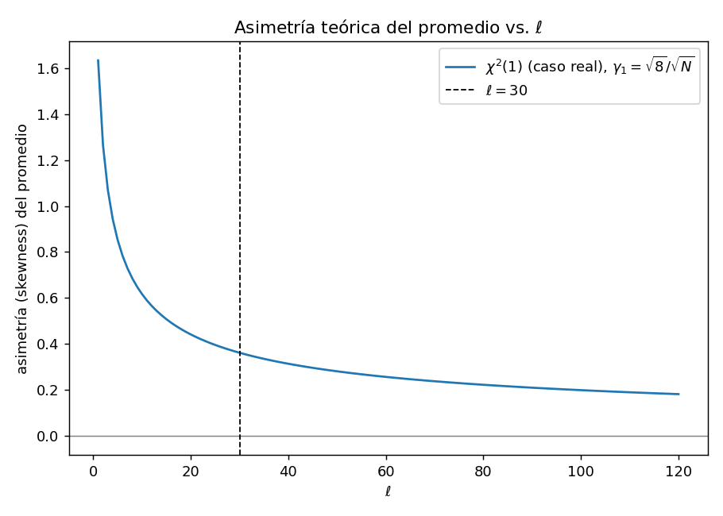
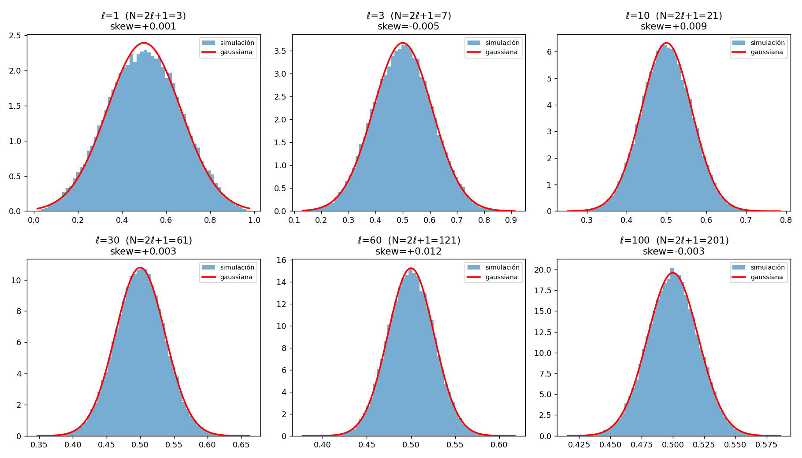

# Tarea 4.7

La distribución de las fluctuaciones de temperatura δT de la radiación cósmica de fondo sigue una distribución gaussiana para cada pareja (ℓ,m). Aquí ℓ y m corresponden a una descomposición de los ángulos sobre la esfera celeste. Ambos son números enteros y satisfacen -ℓ ≤ m ≤ ℓ. Normalmente se grafica algo proporcional a δT² promediado sobre todos los valores de m, para diferentes valores de ℓ. Explique por qué se usa una gaussiana para modelar los errores sobre δT² promediado sólo para ℓ > 30. Haga una simulación para apoyar su resultado suponiendo que la distribución de cada pareja es uniforme (en realidad es una distribución χ² pero use la uniforme por simplicidad).

## Respuesta

Para un ℓ dado, m va de -ℓ a ℓ, así que hay N = 2ℓ+1 valores de m. La cantidad que se grafica es el promedio de δT(ℓ,m)² sobre esos m.

Cada δT(ℓ,m) es gaussiano, pero δT² no lo es. Es un cuadrado de una gaussiana, así que sigue una distribución χ², que es asimétrica. El promedio sobre m es una suma de N de esas variables, entonces por el teorema central del límite su distribución se va pareciendo a una gaussiana a medida que N crece. Si cada término tiene asimetría γ₁, la asimetría del promedio cae como

skew(promedio) = γ₁ / √N

El problema es que N = 2ℓ+1 crece con ℓ. Para ℓ chico hay pocos términos (ℓ=1 da solo 3), y esa fórmula da una asimetría grande, así que el promedio todavía se parece a la χ² y no a una gaussiana. Para ℓ grande hay muchos términos (ℓ=30 da 61) y la asimetría ya cayó lo suficiente. El corte en ℓ=30 es más o menos donde esa asimetría se volvió chica.

Para la distribución real, χ²(1), la asimetría es γ₁ = √8 ≈ 2.83. Entonces:

skew(promedio) = √8 / √N = √(8/N)

Evaluando en distintos ℓ:

| ℓ | N=2ℓ+1 | skew teórico |
|---|---|---|
| 10 | 21 | 0.617 |
| 30 | 61 | 0.362 |
| 60 | 121 | 0.257 |

Se ve que recién alrededor de ℓ=30 la asimetría del promedio baja a valores razonablemente chicos (≲0.4). Ese es el origen del corte en ℓ>30.



## Simulación

Siguiendo el enunciado: cada pareja (ℓ,m) se simula como una uniforme(0,1) en vez de la χ² real.

```python
import numpy as np
from scipy import stats

rng = np.random.default_rng(1)
M = 200_000  # numero de cielos simulados por cada ell

def promedio_uniforme(ell, M, rng):
    N = 2*ell + 1
    muestras = rng.random((M, N))
    return muestras.mean(axis=1), N

mu_teo, var_u = 0.5, 1/12  # media y varianza de una uniforme(0,1)

for ell in [1, 3, 10, 30, 60, 100]:
    prom, N = promedio_uniforme(ell, M, rng)
    var_teo = var_u / N
    skew = stats.skew(prom)
    print(ell, N, prom.mean(), prom.std(), np.sqrt(var_teo), skew)
```

Salida:

```
ell    N    media    sigma    sigma_teo   skew
  1    3   0.4999   0.1666    0.1667    +0.0005
  3    7   0.5000   0.1088    0.1091    -0.0050
 10   21   0.5000   0.0630    0.0630    +0.0087
 30   61   0.5000   0.0370    0.0370    +0.0030
 60  121   0.5001   0.0261    0.0262    +0.0116
100  201   0.5000   0.0203    0.0204    -0.0034
```



La media y la varianza del promedio coinciden con lo esperado (μ=1/2, σ²=1/(12N)) para todo ℓ.

Obs: con la uniforme el ajuste a la gaussiana ya se ve bien desde ℓ=1, mucho antes de ℓ=30. Eso pasa porque la uniforme ya es simétrica de entrada (skew=0), así que no hace falta promediar muchos términos para que el promedio se vea gaussiano. La distribución real, χ²(1), tiene skew=√8≈2.83, bastante lejos de cero, y por eso necesita muchos más términos para que esa asimetría se disminuya. El valor concreto del corte ℓ>30, viene de la asimetría de la χ² real, no de la uniforme.

## Conclusión

El promedio de δT² sobre m es una suma de N=2ℓ+1 variables aleatorias. Para ℓ chico hay pocos términos, y como δT² sigue una distribución χ² (asimétrica), el promedio todavía conserva esa asimetría y no conviene modelarlo como gaussiano. La asimetría del promedio cae como γ₁/√N; usando la asimetría real de la χ²(1), √8/√N, se vuelve chica recién alrededor de N≈60, es decir ℓ≈30, lo que justifica el corte en ℓ>30.
